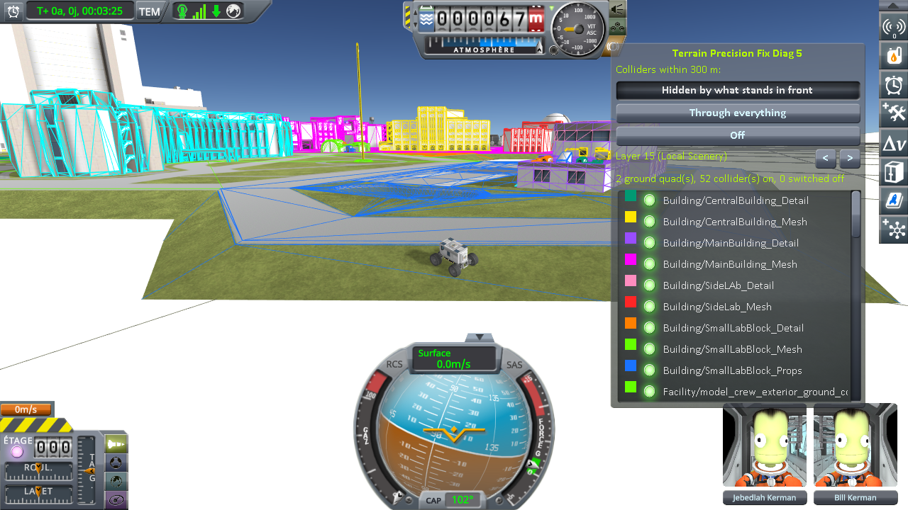
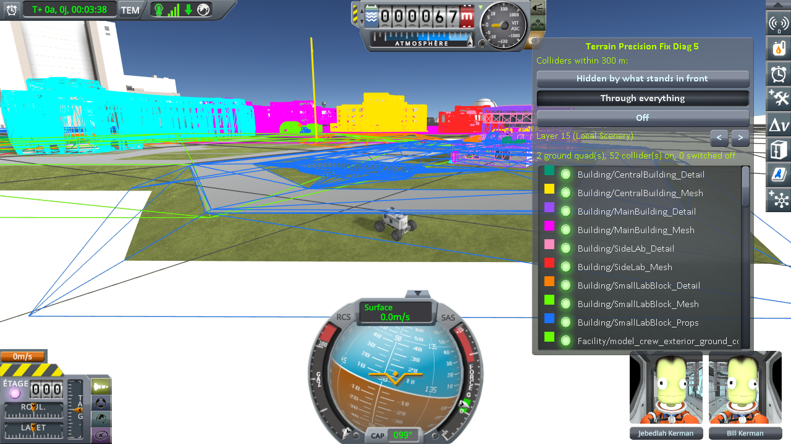
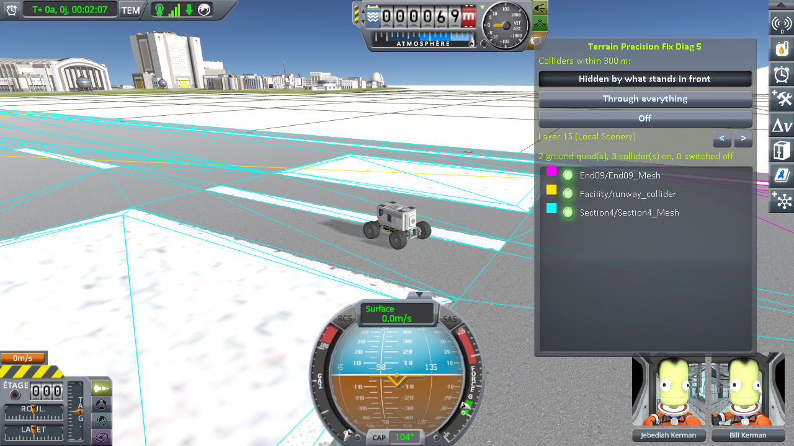

# KSP Diag - Colliders

**⚠️ Work in progress.** This is an active investigation, not a finished mod. The code and this page can still change, and several questions are still open.

A viewing instrument for KSP 1.12. In flight, it draws the colliders within 300 m of the active craft —
what a craft can actually rest on: the ground, as the grey outline of its cells, and the colliders of
the statics (the buildings and runway of the space centre, Kerbal Konstructs groups), each in a colour of
its own. It draws them where the physics has them, which is not always where the game draws the surface
you see. A small window chooses how they are drawn and lists them by name.

It was written to look at the runway of the space centre, where a craft can rest above the deck or sink
into it: what it shows there, and why, is in
[Terrain Precision Fix](https://github.com/lhervier/KSP-TerrainPrecisionFix), in
[Real Solar System: the runway fix](https://github.com/lhervier/KSP-TerrainPrecisionFix/blob/main/docs/non-regression/real-solar-system/the-runway-fix.md).
This mod only shows.

**How this was made.** Written with Claude, Anthropic's AI assistant, and reviewed line by line by a
human — me. I am saying so up front, because contributions made with an AI deserve a closer look than
others, and because some people would rather stop reading here. That look is easy to give here: this
mod changes nothing in the game, it only reads the colliders the game already holds, and the source is
about a thousand lines with no dependency of any kind.

## What it shows

*Stock KSP 1.12.5 with KSP Community Fixes: a rover driven from the runway to the grass beside the SPH,
the window in its default mode.*

**The ground.** A terrain quad is its own collider: stock gives it its mesh as collider. So the
grey cells drawn over the terrain are the collider of the ground itself, outlined only, with no fill and
no diagonals, so that the terrain they stand for stays in sight. Every quad whose collider is on is
drawn, whatever its subdivision level.

**The statics.** Every collider under a `PQSCity` or a `PQSCity2` of the body: the buildings, the runway
and the launchpad of the space centre, the groups of Kerbal Konstructs. Nothing in the mod is specific
to one of them. Each collider that is on gets a colour of its own, out of a palette of ten: no two
colliders share one until more than ten are drawn. A collider switched off (`enabled = false`), which
holds nothing up but is still there, is drawn in pale blue; no `Physics` query returns one, so the mod
finds them by walking the statics.

**One layer.** The colliders of the statics are on layer 15, *Local Scenery*, the layer of the terrain,
and that is the one drawn by default. The window can choose any other: the mod then draws the colliders
of the statics on that layer, and any other collider of that layer that is on — but never the parts of
the active craft. The grey ground is drawn whatever the layer.

Not drawn: triggers, which hold nothing up, and colliders in an object switched off (the other levels of
an upgradeable building, the ruins of an intact one), which are nowhere in the world.

## Where it draws them

The game draws an object through its `Transform`, in `float`, at the place it holds for it. The physics
receives that object's position separately, and the two can differ by a rounding of their own when the
position is the size of a planet's radius. The mod draws each collider **where the physics has it**: at
the centre of the bounds the physics reports for it (`Collider.bounds`), with the rotation and scale of
its `Transform`. So a collider that the physics holds below the surface you see is drawn below it.

This relies on the physics computing the bounds of a collider by transforming its local box, which keeps
its centre. A collider switched off has no bounds: it is drawn where the game draws it.

The drawing follows the colliders at every frame; which colliders are drawn is looked at again four
times a second.

## The window

*The same place and camera as above, with* Through everything *chosen in the window.*

The window opens at the top right of the screen and can be dragged. `Alt+F6` hides it, and shows it again;
the colliders stay drawn.

- **Three modes.** *Hidden by what stands in front*, the default: a collider standing proud of a surface
  shows, one beneath it does not. *Through everything*: every collider drawn on top of the scene, to see
  what lies under the deck of a runway or inside a building. *Off*.
- **The layer**, with `<` and `>`, and its name.
- **How many** ground quads and colliders of statics are drawn, on and switched off.
- **The list of the colliders drawn**, by the name of their parent and their own, each with a swatch of
  its colour and `(off)` when it is switched off. Unticking one stops drawing it, to look at what it
  hides; it stays in the list to be ticked again.

The mode and the layer are kept from one flight to the next until KSP is closed; the unticked
colliders, until the body or the scene changes.

*Stock KSP 1.12.5 with KSP Community Fixes: a rover on the runway of the space centre, in the default
mode.*

## What it draws as it is not

- **A convex `MeshCollider`** is drawn as its mesh, while the physics uses its convex hull. The log says
  which ones are convex.
- **A mesh that scripts cannot read** is drawn as the box of its bounds. The log says which ones.
- **A sphere or a capsule under a scale that is not uniform** is drawn stretched, while the physics
  takes the largest scale.

None of the 114 colliders of the stock space centre named in the log on the runway and around the SPH
is convex or unreadable.

## The log

Every line starts with `[KSPDiagColliders]`. The mod writes:

- the shader it draws with, the body, and each change of mode or layer;
- **each collider of statics, the first time it is drawn**: its full path in the hierarchy, its type,
  whether it is on or switched off, its layer, whether it is convex or unreadable, and how far its centre
  stands from the active craft — the drawing alone does not say which object is which colour;
- at most once a second, when they change, how many ground quads and colliders of statics are drawn;
- **on the window's button *Log the colliders under each craft***, one line per loaded craft: every
  collider of the ground and the statics that a ray fired straight down under the craft meets, nearest
  first, with the object it hangs from, its height above the terrain the game computes there, and whether
  it is active. On a runway, that tells the deck from the ground under it, and a section of the deck from
  another.

## Get it

Either way you end up with the same `GameData/KSPDiagColliders/` folder.

**Download it** — from the assets of the
[latest release](https://github.com/lhervier/KSP-Diag-Colliders/releases/latest).

**Or compile it** — clone this repository, set `KSPDIR` to your KSP install folder and run
`build.bat`. It needs the .NET SDK, takes a few seconds, reads the KSP assemblies straight from your
install, and puts the DLL in `GameData/KSPDiagColliders/` inside the repository. It does
not install anything. Worth doing if you would rather not run a binary you have no source for while
reporting what you saw.

## Install

Drop `GameData/KSPDiagColliders` into the `GameData` of KSP, so that you end up with
`GameData/KSPDiagColliders/KSPDiagColliders.dll`. It runs on a stock install:
no Harmony, no ModuleManager, no dependency of any kind.

The window is there in every flight. The mod reads the colliders and writes nothing but its lines in
`KSP.log`; your saves are never touched. Removing the folder removes the mod.

## License

MIT
